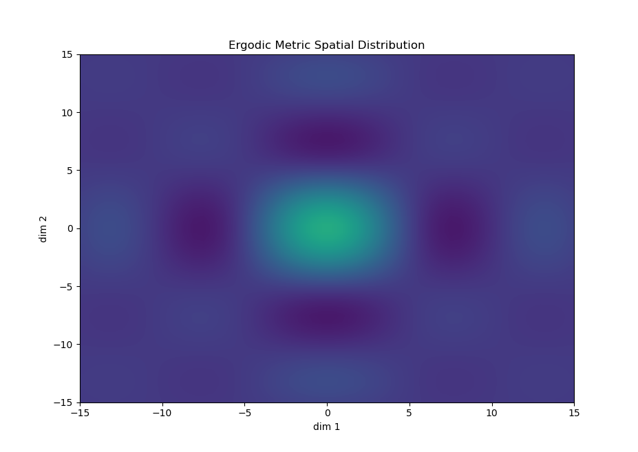
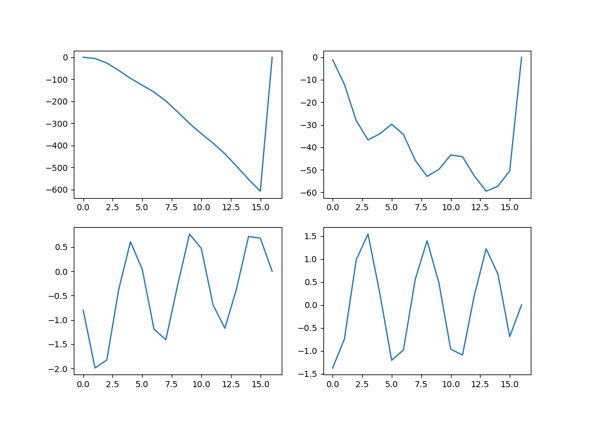
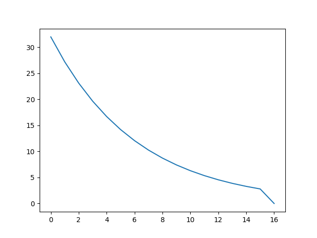

# Ergodic Metric and Controller Library for Dynamic System
## Introduction
This library is a direct implementation of the Ergodic Learning From Demonstration paper: 
Learning from what to do and what not to do, implemented as an Ergodic Metric class function
and a controller class function.

### Ergodic Metric
The Ergodic Metric Phi_k is calculated from the demonstration trajectories as well as the 
positive and negative labels of said demonstration trajectories. 

For all m demonstrations and the fourier series coefficients k, a defintion of the ergodic metric
can be defined as:


Where  represents the weight of 
demonstration j, and  represents
the spatial statistics of the distribution trajectory j for fourier coefficients k.

### Controller
The current controllers implemented only include iLQR at this time. 

The controllers to be implemented include: LQR, KL Divergence

The controller objective function for an LQR system is defined as follows:

Ru(t)dt)

Where q is the weight of the sum of the weight square distance between phi_k and c_k. 

## Installation 
### Important Files
The ergodic controller files are located within `src/ergodic_controller` implemented as Class
files called `ErgodicMeasure`, `controlleriLQR`, and `Plot2DMetric` for calculating the ergodic
metric, the controller, and plotting the metric, respectively. An example of using these functions
can for the cartpole system can be found within `bin/cartpole_ergodic_lfd.py`.

The ROS gazebo simulation files for the cartpole system can be found under `cartpole_gazebo` in
the src folder.

### Install Requirements
To set up the base environment to run the files, you can run the following command to install 
the required packages to run the ergodic controller:

```angular2html
pip install -r requirements.txt
```

### ROS Environment Setup
The cartpole system was written for ROS Noetic (I personally ran it on Ubuntu 22.04). 

To set it up, first copy the `src/cartpole_gazebo` folder to the `src/` folder in your
`catkin_ws`.

Then run the following commands
```angular2html
cd /catkin_ws
source ./devel/setup.bash

catkin_make
```

## Run the files
To run the bare ergodic controller for the cartpole system, run the following line in terminal:
```angular2html
python -m bin.cartpole_ergodic_lfd
```

### Running Ros Gazebo and controller

To launch the ROS gazebo simulation, run the following:
```angular2html
roslaunch cartpole_gazebo cartpole_gazebo
```

If you would like to launch the file to control the cart, run the following:
```angular2html
roslaunch cartpole_gazebo cartpole_control
```

To run the ergodic controller, run the following:
```angular2html
rosrun cartpole_gazebo ergodic_controller
```

## Output 
### Ergodic Metric
An output image for the ergodic metric can be visualized using the `visualize_ergodic` method
in the `Plot2DMetric` class. 



### Controller
The following output image is generated from running the ergodic iLQR controller. 

Trajectory Plot:


Control Plot:


The information contained in this figure includes the trajectory and the controls over a period
of time:


### Demonstration Video
Here is the video of the ergodic metric controller in action using the ROS gazebo simulation 
of a cartpole System

Link here: https://youtu.be/ibh8is8qehY
[](http://www.youtube.com/watch?v=ibh8is8qehY "Cart-pole Ergodic Controller")


## References
[1] Aleksandra Kalinowska, Ahalya Prabhakar, Kathleen Fitzsimons and Todd D. Murphey, 2021, 
Ergodic imitation: Learning from what to do and what not to do. CoRR, abs/2103.17098, 
https://arxiv.org/abs/2103.17098. 

[2] Mathew, George & Mezic, Igor. (2011). Metrics for ergodicity and design of ergodic dynamics 
for multi-agent systems. Physica D: Nonlinear Phenomena. 240. 10.1016/j.physd.2010.10.010. 

[3] Jamil, Mohsin. (2015). Iterative Linear Quadratic Regulator (ILQR) Controller for Trolley 
Position Control of Quanser 3DOF Crane. Indian Journal of Science and Technology. 8.

[4] https://github.com/ros-teleop/teleop_twist_keyboard, Teleop Twist Keyboard 

[5] https://github.com/vikcp/gym-gazebo, Cartpole Gazebo

